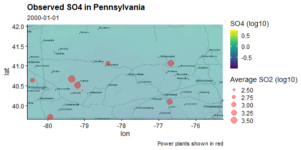

---
output:
  html_document:
    theme: journal
  pdf_document: default
---

```{r setup, include=FALSE, warning=FALSE}
knitr::opts_chunk$set(warning = FALSE, message = FALSE)
library(cowplot)
library(reticulate)
library(lmtest)
library(forecast)
library(glmnet)
library(ggmap)
library(gganimate)
library(viridis)
library(geosphere)
library(rnaturalearth)
library(raster)
library(ncdf4)
library(tidyverse)
library(sp)
library(rgdal)
library(tidyverse)
```

# Exploratory analysis:

## Association between measured power SO2 plant emissions and pollution measurements in Pennsylvania

First I will load the data from a pre-processed`.npz` file with the data from Pennsylvania.

```{python}
# Note: the data is processed in Python (because why not?) So we use reticulate and pure Python to read it.
import numpy as np
dat = np.load("model_dev_data/phil.npz")

print(f"Loading object dat with keys: \"{', '.join(dat.keys())}\".")
r.dat = dat

print("Loading min_lon, max_lon, min_lat, max_lat.")
r.min_lon = min(xi for i, xi in enumerate(dat["xcoords"]) if dat["xcoords_in"][i])
r.max_lon = max(xi for i, xi in enumerate(dat["xcoords"]) if dat["xcoords_in"][i])
r.min_lat = min(xi for i, xi in enumerate(dat["ycoords"]) if dat["ycoords_in"][i])
r.max_lat = max(xi for i, xi in enumerate(dat["ycoords"]) if dat["ycoords_in"][i])

```

### Processing the power plant data

```{r}
power_plants = as.data.frame(t(dat["X"]))
names(power_plants) = paste0("_", dat["locs"][ ,1])
power_plants = power_plants %>% 
  add_column(ym = dat["ym"], .before=1) %>% 
  pivot_longer(names_to="fid", values_to = "so2", cols = -ym) %>% 
  mutate(date=lubridate::ymd(paste0(ym, "01")))
head(power_plants)
```

```{r}
locs = as.data.frame(dat["locs"])
names(locs) = c("fid", "lon", "lat")
locs$fid = paste0("_", locs$fid)
head(locs)
```

Let's print the average so2 and id's of the power plants in the study area.

```{r}
power_plants_in = left_join(power_plants, locs) %>% 
  filter(lon > min_lon, lon < max_lon, lat > min_lat, lat < max_lat)
power_plants_in %>% 
  group_by(fid) %>% 
  summarize(mean_so2=mean(so2))
```

And a plot of the time series of these power plants

```{r}
mean_so2_df = power_plants_in %>%
  group_by(date) %>%
  summarize(mean_so2=mean(so2), .groups="drop") %>% 
  mutate(linetype="daily average")

ggplot() +
  geom_line(
    aes(x=date, y=so2, group=factor(fid)),
    alpha=0.3,
    size=1,
    data=power_plants_in
  ) +
  geom_line(
    aes(x=date, y=mean_so2, linetype=linetype),
    color="black",
    size=2,
    alpha=0.8,
    data=mean_so2_df
  ) +
  labs(
    title="SO2 of every power plant in Pennsylvania area",
    y="SO2",
    linetype=""
  ) +
  theme_cowplot() +
  theme(axis.title.x = element_blank(), legend.position = "top")

```

We see an interesting drop in the pollution levels from all power plants around 2009.

------------------------------------------------------------------------

### Processing the observed SO4 in the Pennsylvania grid

```{r}
ygrid = dat["y"]
xcoords = dat["xcoords"]
ycoords = dat["ycoords"]

xcoords_in = xcoords[dat["xcoords_in"]]
ycoords_in = ycoords[dat["ycoords_in"]]

nr = dim(ygrid)[1]
nc = dim(ygrid)[2]
nt = dim(ygrid)[3]

obs = expand.grid(
  y=1:nr,
  x=1:nc,
  t=1:nt
)

dates = lubridate::ymd(paste0(dat["ym"], "01"))

obs$so4 = as.vector(ygrid)
obs = obs %>%
  mutate(
    lon=xcoords_in[x],
    lat=ycoords_in[y],
    date=dates[t]
  )
utils::tail(obs %>% select(-c(t, x, y)))
```

### Visualization in a map

First to get an idea of the data, let's produce a visualization of the pollution and the power plants. This way we can an idea of how the pollution changes over time.

*Notes:* The code of the visualization is a bit lengthy but gives a good idea of what kind of data we are dealing with.

```{r}
# This one can take a while running
bbox = c(left=min_lon, right=max_lon, bottom=min_lat, top=max_lat)
basemap = get_stamenmap(bbox, zoom = 8, maptype = "toner-lite") %>% 
  ggmap() +
  coord_cartesian()

power_plants_in_size = power_plants_in %>% 
  group_by(fid, lon, lat) %>% 
  summarize(mean_so2 = mean(so2))
map = basemap +
  geom_raster(
    aes(x=lon, y=lat, fill=log10(so4)), 
    alpha=0.5,
    data=filter(obs, t <= 24)
  ) +
  transition_time(date) +
  scale_fill_viridis() +
  geom_point(
    aes(x=lon, y=lat, size=log10(mean_so2)),
    color="red",
    alpha=0.4,
    data=power_plants_in_size
  ) +
  labs(
    title="Observed SO4 in Pennsylvania",
    subtitle="{as.character(frame_time)}",
    caption="Power plants shown in red",
    fill="SO4 (log10)",
    size="Average SO2 (log10)"
  ) +
  theme_cowplot()


# animate(
#   map,
#   duration = 12,
#   fps = 4,
#   width = 600,
#   height = 300,
#   renderer = gifski_renderer()
# )
# 
# anim_save("anim.gif", path="gif")
```



------------------------------------------------------------------------

### Some data transforms

Let's look at different histograms for the data to find a good power transform to stabilize the variance. Because logarithm actually creates too heavy lower tails (not shown here). It turns out that for both power plant SO2 and observed PM2.5 a power transform of square root stabilizes the variance.

First with power plant emissions data

```{r}
lams = c(0.01, 0.05, 0.2, 0.5, 0.75, 1.0)
par(mfrow=c(2, 3))
for (lam in lams) {
  trans = (power_plants_in$so2 ^ lam - 1) / lam
  hist(trans, main=paste0("lam=", lam), col=alpha("blue", 0.3))
}
```

```{r}
power_plants$so2_trans = (power_plants$so2 ^ 0.2 - 1) / 0.2
power_plants_in$so2_trans = (power_plants_in$so2 ^ 0.2 - 1) / 0.2

mean_so2_df = power_plants_in %>%
  group_by(date) %>%
  summarize(mean_so2=mean(so2_trans), .groups="drop")

ggplot() +
  geom_line(
    aes(x=date, y=so2_trans, color=factor(fid)),
    alpha=0.8,
    size=1,
    data=power_plants_in
  ) +
  # geom_line(
  #   aes(x=date, y=mean_so2),
  #   color="black",
  #   size=2,
  #   alpha=0.8,
  #   data=mean_so2_df
  # ) +
  labs(title="SO2 of every power plant 1/5 power transform", y="so2") +
  theme_cowplot() +
  theme(axis.title.x = element_blank())
```

It's useful to look at the auto-correlation to understand the data.

```{r}
acfs = power_plants %>% 
  arrange(fid, date) %>% 
  group_by(fid) %>% 
  group_map(
    ~ tibble(
      fid=.x$fid[1],
      acf=as.vector(acf(.x$so2_trans, lag.max = 20, plot=FALSE)$acf),
      pacf=c(1.0, as.vector(pacf(.x$so2_trans, lag.max = 20, plot=FALSE)$acf)),
      lag=0:20
    ),
    .keep=TRUE
  ) %>% 
  bind_rows 

acfs_piv = acfs %>% 
  pivot_longer(
    names_to="variable",
    values_to="value",
    cols=-c(lag, fid)
  )
acfs_piv_m = acfs_piv %>% 
  group_by(variable, lag) %>% 
  summarize(m=mean(value), .groups="drop") %>% 
  mutate(linetype="average per lag")

ggplot() +
  geom_line(
    aes(x=lag, y=value, group=fid),
    data=acfs_piv,
    size=1,
    alpha=0.1,
  ) +
  geom_point(
    aes(x=lag, y=m, color=linetype),
    data=acfs_piv_m,
    size=3,
    alpha=0.8,
  ) +
  facet_wrap(variable ~ .) +
  geom_vline(xintercept=12, col="red") +
  labs(
    title="Auto-correlation plots power-plant SO2 data",
    color=""
  ) +
  theme_cowplot() +
  theme(legend.position = "bottom")
```

Let's repeat the exercise for observed SO2. For convenience, let's only look at 100 random location in the Pennsylvania grid.

```{r}
obsmean = obs %>% 
  group_by(x, y) %>% 
  summarize(m=mean(so4), .groups="drop") %>% 
  arrange(desc(m))
rows = 1:10
# rows = sample(nrow(obsmean), 10)
topx = obsmean$x[rows]
topy = obsmean$y[rows]
dates = lubridate::ymd(paste0(dat["ym"], "01"))
obsf = obs %>% 
  filter(x %in% topx, y %in% topy) %>% 
  mutate(
    loc=paste0(x, "_", y),
    dates=dates[t]
  ) 
head(obsf)
```

```{r}
ggplot() +
  geom_line(
    aes(x=dates, y=so4^0.2, group=loc),
    data=obsf,
    size=1,
    alpha=0.05
  ) +
  theme_cowplot() +
  labs(
    title="SO4 (1/5 power transform) at random locations in Pennsylvania",
    y="SO4"
  ) +
  theme(axis.title.x = element_blank())
```

We arrive at the same conclusion that a good power transform is 0.2.

```{r}
obs$so4_trans = (obs$so4^0.4 - 1) / 0.4
obsf$so4_trans = (obsf$so4^0.4 - 1) / 0.4
```

```{r}
ggplot() +
  geom_line(
    aes(x=dates, y=so4_trans, group=loc),
    data=obsf,
    size=1,
    alpha=0.3
  ) +
  theme_cowplot() +
  labs(
    title="SO4 at random locations in Pennsylvania",
    y="PM 2.5"
  ) +
  theme(axis.title.x = element_blank())
```

Let's analyze the auto-correlation in the data as well as fill ARIMA models to it.

```{r}
acfs = obsf %>% 
  arrange(loc, dates) %>% 
  group_by(loc) %>% 
  group_map(
    ~ tibble(
      loc=.x$loc[1],
      acf=as.vector(acf(.x$so4_trans, lag.max = 20, plot=FALSE)$acf),
      pacf=c(1.0, as.vector(pacf(.x$so4_trans, lag.max = 20, plot=FALSE)$acf)),
      lag=0:20
    ),
    .keep=TRUE
  ) %>% 
  bind_rows 

acfs_piv = acfs %>% 
  pivot_longer(
    names_to="variable",
    values_to="value",
    cols=-c(lag, loc)
  )

acfs_piv_m = acfs_piv %>% 
  group_by(variable, lag) %>% 
  summarize(m=mean(value), .groups="drop") %>% 
  mutate(linetype="mean per lag")

ggplot() +
  geom_line(
    aes(x=lag, y=value, group=loc),
    data=acfs_piv,
    size=1,
    alpha=0.1,
  ) +
  geom_point(
    aes(x=lag, y=m, color=linetype),
    data=acfs_piv_m,
    size=3,
    alpha=0.8,
  ) +
  facet_wrap(variable ~ .) +
  geom_vline(xintercept=12, col="red") +
  labs(
    title="Auto-correlation plots SO4 data at random locations",
    color=""
  ) +
  theme_cowplot() +
  theme(legend.position = "top")
```

We see that it may require high order ARIMAs.

```{r}
dfarma = obsf %>% 
  group_by(loc) %>% 
  group_map(~ {
    mod = auto.arima(.x$so4_trans, D=12)
    ar = mod$arma[1]
    ma = mod$arma[2]
    intr = mod$arma[6]
    tibble(fid=.x$loc[1], ar=ar, ma=ma, intr=intr)
  }, .keep=TRUE) %>% 
  bind_rows()

dfarma %>% 
  summarize(
    ar=mean(ar),
    ma=mean(ma),
    intr=mean(intr),
    .groups="drop"
  )
```

The analysis that most of the time the ARIMA model uses an AR(1,1,1) model. From the auto-correlation plots it is also evident that there is a yearly seasonal effect.

## 3 Correlation and partial correlation analysis

The goal of this section is to study the extent to which spurious correlation appear in the data. This is critical to assess whether a correlation approach for causal effects can be applied directly.

The approach we will take is to

(1) Fixed an observation unit in Pennsylvania with high average pollution.

(2) Measure the correlations of the fixed location with all power plants across the USA.

(3) Repeat the procedure for lagged versions of the variables.

#### Correlations

We would expect that (controlling for the power plant size) the correlations would decrease with the distance.

```{r}
# fix unit
y = obsf %>% 
  filter(x==obsmean$x[1], y==obsmean$y[1]) %>% 
  pull(so4_trans)

# fixed unit location
unit_lon = xcoords_in[obsmean$x[1]]
unit_lat = ycoords_in[obsmean$y[1]]
  dists=tibble(
  fid=locs[ ,1],
  dist=distm(locs[ ,-1], c(unit_lon, unit_lat)) / 1000  # in km
)

sizes = power_plants %>% 
  group_by(fid) %>% 
  summarize(size=mean(so2), .groups="drop")

X = power_plants %>% 
  select(fid, date, so2_trans) %>% 
  pivot_wider(values_from=so2_trans, names_from=fid) %>% 
  select(-date) %>% 
  as.matrix()

fid = dimnames(X)[[2]]
p = length(fid)
corrs_lag0 = cor(X, y)
corrs_lag1 = cor(X[-nrow(X), ], y[-1])
corrs_lag2 = cor(X[-((nrow(X) - 1):nrow(X)), ], y[-(1:2)])

corrs = tibble(
  fid=rep(fid, 3),
  corr=c(corrs_lag0, corrs_lag1, corrs_lag2),
  lag=rep(paste("lag", 0:2), each=p)
) %>% 
  left_join(sizes, by="fid") %>% 
  left_join(locs, by="fid") %>% 
  left_join(dists, by="fid")

head(corrs)
```

```{r}
ggplot(corrs) +
  geom_point(aes(x=dist, y=corr, size=size)) +
  facet_wrap(~lag, ncol=3) +
  theme_cowplot() +
  labs(
    x="distance (km)",
    y="correlation coefficient",
    size="Mean SO2",
    title="Correlation of Penn. pollution and every power plant",
    subtitle="Pairwise independent correlations",
    caption=sprintf(
      "Coordinates (%s, %s) in Pennsylvania as reference", unit_lon, unit_lat
    )
  )

```

The only conclusion we can draw from the above plot is that **everything** is correlated.

#### Partial correlations (regression)

Since there are more variables than time points, we need to take a partial correlation approach with regression. We can try to regularization schemes:

1.  Minimal regularization
2.  Optimal regularization

In both cases we will use Ridge regression. Another important thing, is that we want to normalize the relative size of each power plant so that the coefficient is not associated with the relative size of the power plant.

##### Minimal Regularization

```{r}
fnames = paste0(rep(fid, 3), "_lag", rep(0:2, each=p))
X_ = na.omit(cbind(X, lag(X, 1), lag(X, 2)))
X_ = scale(X_, center=TRUE, scale=FALSE)
y_ = y[-(1:2)]
mod = glmnet(X_, y_, alpha=0.0, lambda = 1e-3)

pcorrs_minimal = tibble(
  fid=rep(fid, 3),
  coef=as.vector(mod$beta),
  lag=rep(paste("lag", 0:2), each=p)
) %>% 
  left_join(sizes, by="fid") %>% 
  left_join(locs, by="fid") %>% 
  left_join(dists, by="fid")

head(pcorrs_minimal)
```

```{r}
ggplot(pcorrs_minimal) +
  geom_point(aes(x=dist, y=coef, size=size)) +
  facet_wrap(~lag, ncol=3) +
  theme_cowplot() +
  labs(
    x="distance (km)",
    y="regression coefficient",
    size="Mean SO2",
    title="Reg. coeffs. of Penn. pollution and every power plant",
    subtitle="Minimal regularization (ridge ~ 1e-3)",
    caption=sprintf(
      "Coordinates (%s, %s) in Pennsylvania as reference", unit_lon, unit_lat
    )
  )
```

The behavior is somewhat puzzling. We still see large correlations with far away power plants. Contrary to the pure correlation case, we would expect to see a large effect from larger power plants, but we are also not really seeing that. This time we do see a decrease with lag value but only really small. A worrying observation is the appearance of strong negative associations. One possible explanations is causality. To account for the auto-correlation and seasonality of the dependent variable, we will include a lag-1 and lag-12 in the regression.

```{r}
X_ = na.omit(cbind(lag(y, 1), lag(y, 12), X, lag(X, 1), lag(X, 2)))
X_ = scale(X_, center=TRUE, scale=FALSE)
y_ = y[-(1:12)]
mod = glmnet(X_, y_, alpha=0.0, lambda = 1e-3)

pcorrs_minimal_auto = tibble(
  fid=rep(fid, 3),
  coef=as.vector(mod$beta[-(1:2)]),
  lag=rep(paste("lag", 0:2), each=p)
) %>% 
  left_join(sizes, by="fid") %>% 
  left_join(locs, by="fid") %>% 
  left_join(dists, by="fid")
```

```{r}
ggplot(pcorrs_minimal_auto) +
  geom_point(aes(x=dist, y=coef, size=size)) +
  facet_wrap(~lag, ncol=3) +
  theme_cowplot() +
  labs(
    x="distance (km)",
    y="regression coefficient",
    size="Mean SO2",
    title="Reg. coeffs. of Penn. pollution and every power plant",
    subtitle="Minimal regularization (ridge ~ 1e-3) and auto-corr. adjustment",
    caption=sprintf(
      "Coordinates (%s, %s) in Pennsylvania as reference", unit_lon, unit_lat
    )
  )
```

##### Optimal regularization

We will repeat the approach of the last model but with optimal regularization.

```{r}
lambs = 10 ^ seq(-3, 3, by=0.1)
cv_mod = cv.glmnet(X_, y_, alpha=0.0, lambda=lambs, nfolds=5)
plot(cv_mod)
```

```{r}
mod = glmnet(X_, y_, alpha=0.0, lambda=cv_mod$lambda.min)

pcorrs_opt = tibble(
  fid=rep(fid, 3),
  coef=as.vector(mod$beta[-(1:2)]),
  lag=rep(paste("lag", 0:2), each=p)
) %>% 
  left_join(sizes, by="fid") %>% 
  left_join(locs, by="fid") %>% 
  left_join(dists, by="fid")

head(pcorrs_opt)
```

```{r}
ggplot(pcorrs_opt) +
  geom_point(aes(x=dist, y=coef, size=size)) +
  facet_wrap(~lag, ncol=3) +
  theme_cowplot() +
  labs(
    x="distance (km)",
    y="regression coefficient",
    size="Mean SO2",
    title="Reg. coeffs. of Penn. pollution and every power plant",
    subtitle=sprintf(
      "Optimal regularization (ridge ~ %.2f) and auto-corr. adjustment",
      cv_mod$lambda.min
    ),
    caption=sprintf(
      "Coordinates (%s, %s) in Pennsylvania as reference", unit_lon, unit_lat
    )
  )
```

This last plot suggests that the path of regression is not taking us anywhere. Just for the sake for completeness, let's repeat the above exercise using lasso instead of ridge.

```{r}
lambs = 10 ^ seq(-3, 1, by=0.1)
cv_mod = cv.glmnet(X_, y_, alpha=1.0, lambda=lambs, nfolds=5)
plot(cv_mod)
```

```{r}
mod = glmnet(X_, y_, alpha=1.0, lambda=cv_mod$lambda.min)

pcorrs_opt_lasso = tibble(
  fid=rep(fid, 3),
  coef=as.vector(mod$beta[-(1:2)]),
  lag=rep(paste("lag", 0:2), each=p)
) %>% 
  left_join(sizes, by="fid") %>% 
  left_join(locs, by="fid") %>% 
  left_join(dists, by="fid")

head(pcorrs_opt_lasso)
```

```{r}
ggplot(pcorrs_opt_lasso) +
  geom_point(aes(x=dist, y=coef, size=size)) +
  facet_wrap(~lag, ncol=3) +
  theme_cowplot() +
  labs(
    x="distance (km)",
    y="regression coefficient",
    size="Mean SO2",
    title="Reg. coeffs. of Penn. pollution and every power plant",
    subtitle=sprintf(
      "Optimal l1-regularization (lasso ~ %.2f) and auto-corr. adjustment",
      cv_mod$lambda.min
    ),
    caption=sprintf(
      "Coordinates (%s, %s) in Pennsylvania as reference", unit_lon, unit_lat
    )
  )
```

The sparsity is not helping. A few negative regression from really far away power plants is not believable.

So let's enforce the positivity constraint.

```{r}
cv_mod = cv.glmnet(X_, y_, alpha=1.0, lambda=lambs, nfolds=5, lower.limits=0.0)
mod = glmnet(X_, y_, alpha=1.0, lambda=cv_mod$lambda.min, lower.limits=0.0)

pcorrs_opt_lasso_pw = tibble(
  fid=rep(fid, 3),
  coef=as.vector(mod$beta[-(1:2)]),
  lag=rep(paste("lag", 0:2), each=p)
) %>% 
  left_join(sizes, by="fid") %>% 
  left_join(locs, by="fid") %>% 
  left_join(dists, by="fid")

ggplot(pcorrs_opt_lasso_pw) +
  geom_point(aes(x=dist, y=coef, size=size)) +
  facet_wrap(~lag, ncol=3) +
  theme_cowplot() +
  labs(
    x="distance (km)",
    y="regression coefficient",
    size="Mean SO2",
    title="Reg. coeffs. of Penn. pollution and every power plant",
    subtitle=sprintf(
      "Optimal l1-regularization (lasso ~ %.2f), auto-corr. adj. and ositivity constraint",
      cv_mod$lambda.min
    ),
    caption=sprintf(
      "Coordinates (%s, %s) in Pennsylvania as reference", unit_lon, unit_lat
    )
  ) +
  scale_y_log10()
```

## 4 Spatial regression analysis

The single point regression analysis did not show any signs of being useful. One can hope that by using a spatial model that borrows strength form spatial information the model will be more consistent with reality. The intuition is that instead of having more features that observations, by simultaneously asking to predict the entire grid with smoothly varying coefficients, we now have many more effective observations relative to explanatory variables.

[in separate analysis]

## Extras

### Adding controls

```{r}
# obtained from the download_met_data.R function
controls = readRDS("data/controls.rds")
controls = controls[names(controls) %in% dat["ym"]]
```

```{r}
# write covariates .tif
crs_usa = raster::crs("+proj=lcc +lat_1=33 +lat_2=45 +lat_0=40 +lon_0=-97 +a=6370000 +b=6370000")

crs_wgs84 = raster::crs("+proj=longlat +ellps=WGS84 +datum=WGS84 +no_defs")

for (t in 1:length(controls)) {
  nm = names(controls)[t]
  rast = controls[[t]]
  rast = projectRaster(rast, crs=crs_wgs84)
  fname = sprintf("model_dev_data/covariates/%s.tif", nm)
  raster::writeRaster(rast, fname, overwrite=TRUE)
}
```

```{r}
coords = expand.grid(lon=xcoords_in, lat=ycoords_in)
meteo = controls %>% 
  map(raster::extract, coords)
```

```{r}
nd = ncol(meteo[[1]])
meteo_array = array(0, c(nr, nc, nd, nt))
```

```{r}
ym = dat["ym"]
for (t in 1:nt) {
  M = meteo[[t]]
  for (j in 1:nd)
    meteo_array[ , , j, t] = matrix(M[, j], nr, nc, byrow=FALSE)
}
```

```{python}
np.save("model_dev_data/phil_controls.npy", r.meteo_array)
```

```{r}
test_obs_coords = obsf %>% 
  filter(x==obsmean$x[1], y==obsmean$y[1])
c = test_obs_coords$x[1]
r = test_obs_coords$y[1]

covars = t(meteo_array[r, c, , ])

X_ = na.omit(cbind(lag(y, 1), lag(y, 12), covars, X))
# X_ = cbind(covars, X)
X_ = scale(X_, center=TRUE, scale=FALSE)
y_ = y[-(1:12)]
# y_ = y

lambs = 10 ^ seq(-3, 3, by=0.1)
cv_mod = cv.glmnet(X_, y_, alpha=1.0, lambda=lambs, nfolds=5)
plot(cv_mod)
```

```{r}
mod = glmnet(X_, y_, alpha=1.0, lambda=cv_mod$lambda.min)

pcorrs_covars = tibble(
  fid=fid,
  coef=as.vector(mod$beta[-(1:9)]),
) %>% 
  left_join(sizes, by="fid") %>% 
  left_join(locs, by="fid") %>% 
  left_join(dists, by="fid")

ggplot(pcorrs_covars) +
  geom_point(aes(x=dist, y=coef, size=size)) +
  theme_cowplot() +
  labs(
    x="distance (km)",
    y="regression coefficient",
    size="Mean SO2",
    title="Reg. coeffs. of Penn. pollution and every power plant",
    subtitle=sprintf(
      "lasso + autoreg + covariates",
      cv_mod$lambda.min
    ),
    caption=sprintf(
      "Coordinates (%s, %s) in Pennsylvania as reference", unit_lon, unit_lat
    )
  ) +
  scale_y_log10()
```

```{r}
# var=dimnames(meteo[[1]])[[2]]
var=c(dimnames(meteo[[1]])[[2]], "y.lag.1", "y.lag.12")
tibble(var=var, coef=mod$beta[1:9])
```

### ZIP code coordinates

```{r}
zipsp = readOGR("data/tl_2016_us_zcta510/tl_2016_us_zcta510.shp")
zipsp@data %>% 
  mutate(
    lat=as.numeric(INTPTLAT10),
    lon=as.numeric(INTPTLON10)
  ) %>% 
  rename(ZIP=GEOID10) %>% 
  select(ZIP, lon, lat) %>% 
  write_csv("model_dev_data/zip_coords.csv")
```
